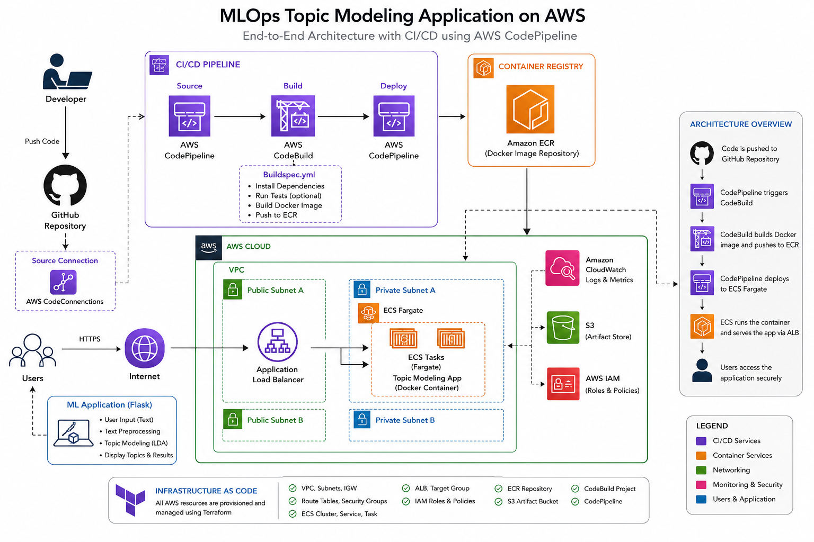
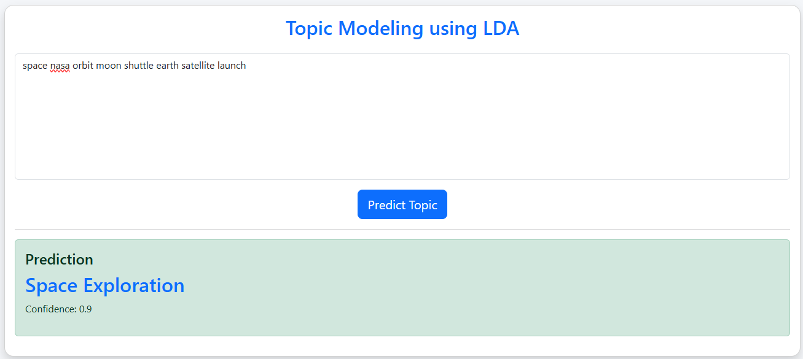

# 🚀 MLOps Topic Modeling Application on AWS

> **Production-ready Machine Learning Deployment using Flask, Docker, Terraform, Amazon ECS Fargate, Amazon ECR, Application Load Balancer, CloudWatch, and AWS CI/CD.**


---

# 📖 Overview

This project demonstrates an **end-to-end MLOps deployment** of a Machine Learning application on AWS using modern DevOps practices.

The application predicts topics from user-provided text using Natural Language Processing (NLP). The complete infrastructure is provisioned using **Terraform**, containerized using **Docker**, deployed on **Amazon ECS Fargate**, exposed through an **Application Load Balancer**, monitored with **CloudWatch**, and integrated with **AWS CodePipeline** for CI/CD.

---

# 🎯 Project Objectives

- Deploy a Machine Learning application on AWS
- Containerize the application using Docker
- Provision cloud infrastructure using Terraform
- Deploy containers on Amazon ECS Fargate
- Implement Infrastructure as Code (IaC)
- Integrate CI/CD using AWS CodePipeline
- Follow production-ready cloud architecture practices

---

# 🏗️ Solution Architecture


<p align="center">



</p>

---

## 🎥 Application Demo

### Home Page



---

# ⚙️ Architecture Workflow

```text
                     Developer

                         │
                         ▼

                 GitHub Repository

                         │
                         ▼

                 AWS CodePipeline

                         │
                         ▼

                  AWS CodeBuild

                         │
                         ▼

                  Docker Image

                         │
                         ▼

                   Amazon ECR

                         │
                         ▼

                 Amazon ECS Fargate

                         │
                         ▼

           Application Load Balancer

                         │
                         ▼

                Flask Web Application

                         │
                         ▼

                  Topic Prediction
```

---

# 🚀 Features

- Machine Learning Topic Prediction
- Flask Web Interface
- REST API
- Docker Containerization
- Gunicorn Production Server
- Amazon ECS Deployment
- Application Load Balancer
- CloudWatch Logging
- Infrastructure as Code
- Continuous Integration & Deployment
- Fully Automated AWS Infrastructure

---

# ☁️ AWS Services Used

| Service | Purpose |
|----------|----------|
| Amazon ECS Fargate | Container Orchestration |
| Amazon ECR | Docker Registry |
| Application Load Balancer | Traffic Distribution |
| Amazon VPC | Networking |
| CloudWatch | Logging |
| IAM | Security |
| CodePipeline | CI/CD |
| CodeBuild | Docker Build |
| CodeConnections | GitHub Integration |
| Terraform | Infrastructure as Code |

---

# 📂 Project Structure

```text
mlops-topic-modeling-aws
│
├── app/
│   ├── routes/
│   ├── services/
│   ├── templates/
│   ├── static/
|   ├── models/
│   └── main.py
│
├── terraform/
│   ├── networking.tf
│   ├── security.tf
│   ├── alb.tf
│   ├── ecr.tf
│   ├── ecs_cluster.tf
│   ├── ecs_task.tf
│   ├── ecs_service.tf
│   ├── iam.tf
│   ├── codebuild.tf
│   ├── codepipeline.tf
│   ├── variables.tf
│   ├── outputs.tf
│   └── terraform.tfvars.example
│
├── scripts/
│   ├── push_to_ecr.ps1
│   └── deploy.ps1
│
├── images/
│   ├── architecture.png
│   └── home.png
|
├── Dockerfile
├── buildspec.yml
├── requirements.txt
├── README.md
└── .gitignore
```

---

# 🌐 Infrastructure Provisioned

Terraform provisions:

- VPC
- Public Subnets
- Internet Gateway
- Route Tables
- Security Groups
- Application Load Balancer
- Target Group
- ECS Cluster
- ECS Service
- ECS Task Definition
- Amazon ECR Repository
- IAM Roles
- CloudWatch Log Group
- CodeBuild Project
- CodePipeline

---

# 🐳 Docker Workflow

```text
Application Code

      │

      ▼

Docker Build

      │

      ▼

Docker Image

      │

      ▼

Amazon ECR

      │

      ▼

Amazon ECS
```

---

# 🔄 CI/CD Pipeline

```text
Developer

    │

    ▼

Git Push

    │

    ▼

GitHub

    │

    ▼

AWS CodePipeline

    │

    ▼

AWS CodeBuild

    │

    ▼

Docker Build

    │

    ▼

Push Image to Amazon ECR

    │

    ▼

Deploy to ECS

    │

    ▼

Application Updated
```

---

# 🧠 Machine Learning Workflow

```text
User Input

      │

      ▼

Text Cleaning

      │

      ▼

Tokenization

      │

      ▼

Stopword Removal

      │

      ▼

Lemmatization

      │

      ▼

Topic Prediction

      │

      ▼

Predicted Topic
```

---

# 💻 Run Locally

Clone the repository

```bash
git clone https://github.com/Eeshan2001/aws-mlops-project.git

cd aws-mlops-project.git
```

Install dependencies

```bash
pip install -r requirements.txt
```

Run application

```bash
python run.py
```

Visit

```
http://localhost:5000
```

---

# 🐳 Docker

Build

```bash
docker build -t topic-modeling-app:v1 .
```

Run

```bash
docker run -p 5000:5000 topic-modeling-app:v1
```

---

# ☁️ Deploy Infrastructure

```bash
cd terraform

terraform init

terraform plan

terraform apply
```

---

# 🚀 Push Image to Amazon ECR

```powershell
.\scripts\push_to_ecr.ps1
```

---

# 🌍 Access Application

After deployment

```
http://<ALB-DNS-NAME>
```

---

# 📊 Monitoring

Logs are available in:

```text
CloudWatch

↓

Log Groups

↓

topic-modeling
```

---

# 🔐 Security Best Practices

- IAM Least Privilege
- Security Groups
- ECS Task Execution Role
- Private Amazon ECR Repository
- CloudWatch Centralized Logging
- Infrastructure managed with Terraform

---

# 💰 Cost Optimization

To minimize AWS costs for a personal account:

- ECS Fargate (single task)
- Public subnets (avoiding NAT Gateway charges)
- Small Fargate task size
- Application Load Balancer only
- Minimal CloudWatch retention
- No Auto Scaling enabled

---

# 📈 Future Enhancements

- HTTPS using ACM
- Route53 Custom Domain
- ECS Auto Scaling
- Blue/Green Deployment
- AWS Secrets Manager
- Amazon RDS
- Prometheus & Grafana
- GitHub Actions
- Automated Unit Tests
- Multi-Environment Deployment

---

# 🛠️ Tech Stack

| Category | Technology |
|----------|------------|
| Programming | Python |
| Framework | Flask |
| ML | Scikit-learn |
| NLP | NLTK |
| Container | Docker |
| Web Server | Gunicorn |
| IaC | Terraform |
| Cloud | AWS |
| Registry | Amazon ECR |
| Compute | Amazon ECS Fargate |
| Networking | ALB, VPC |
| Monitoring | CloudWatch |
| CI/CD | CodePipeline & CodeBuild |

---

# 💡 Design Decisions

### Why ECS Fargate?

- No EC2 management
- Serverless container hosting
- High availability
- Pay for resources used

### Why Terraform?

- Infrastructure as Code
- Version controlled infrastructure
- Reproducible deployments
- Easy collaboration

### Why Docker?

- Environment consistency
- Easy deployment
- Lightweight containers

### Why Application Load Balancer?

- Native ECS integration
- Health checks
- Traffic distribution
- Internet-facing endpoint

---

# 📚 Lessons Learned

During this project, I gained practical experience in:

- Designing AWS networking for containerized applications.
- Managing infrastructure with Terraform.
- Debugging ECS task definition and container deployment issues.
- Configuring IAM roles and least-privilege access.
- Troubleshooting Docker image pushes to Amazon ECR.
- Integrating GitHub with AWS CodePipeline and CodeBuild.
- Optimizing architecture for a personal AWS account by avoiding unnecessary NAT Gateway costs.
- Managing Terraform state and importing existing AWS resources.

---


# 🎯 Skills Demonstrated

- Machine Learning Deployment
- MLOps
- Docker
- Terraform
- Infrastructure as Code
- AWS ECS
- Amazon ECR
- Cloud Networking
- IAM
- DevOps
- Python
- Flask
- CI/CD
- CloudWatch

---

# 🏆 Resume Highlights

- Designed and deployed an end-to-end MLOps platform on AWS using Amazon ECS Fargate, Docker, Amazon ECR, Application Load Balancer, and Terraform.
- Containerized a Flask-based machine learning application using Docker and deployed it using Gunicorn.
- Automated cloud infrastructure provisioning with Terraform, including networking, IAM, ECS services, CloudWatch logging, and load balancing.
- Built a CI/CD pipeline integrating GitHub, AWS CodePipeline, and CodeBuild for automated application deployments.
- Implemented secure IAM policies and production-ready Infrastructure as Code following AWS best practices.

---

# 👨‍💻 Author

**Eeshan Chanpura**

Cloud Software Developer | Platform SRE | AWS | Terraform | Docker | Python | MLOps

LinkedIn: https://www.linkedin.com/in/eeshan-chanpura-2a9bbb1b5/

GitHub: https://github.com/Eeshan2001

---

## ⭐ Support

If you found this project helpful, consider giving it a ⭐ on GitHub!
